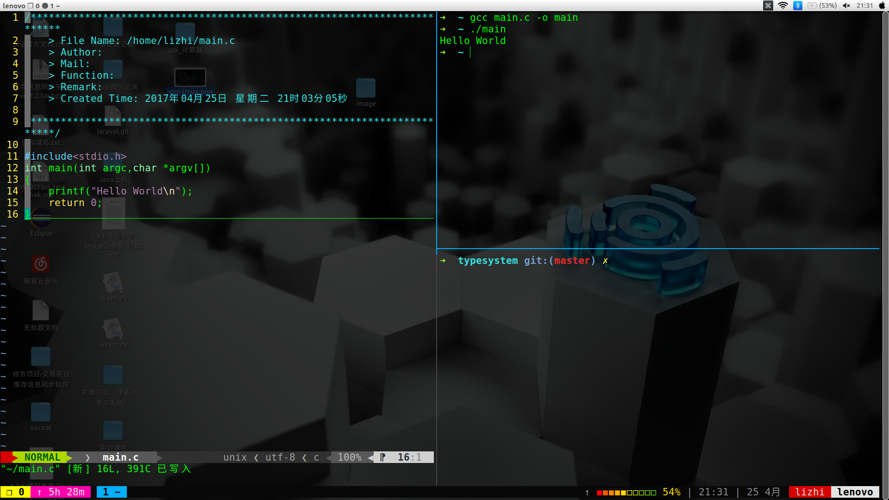
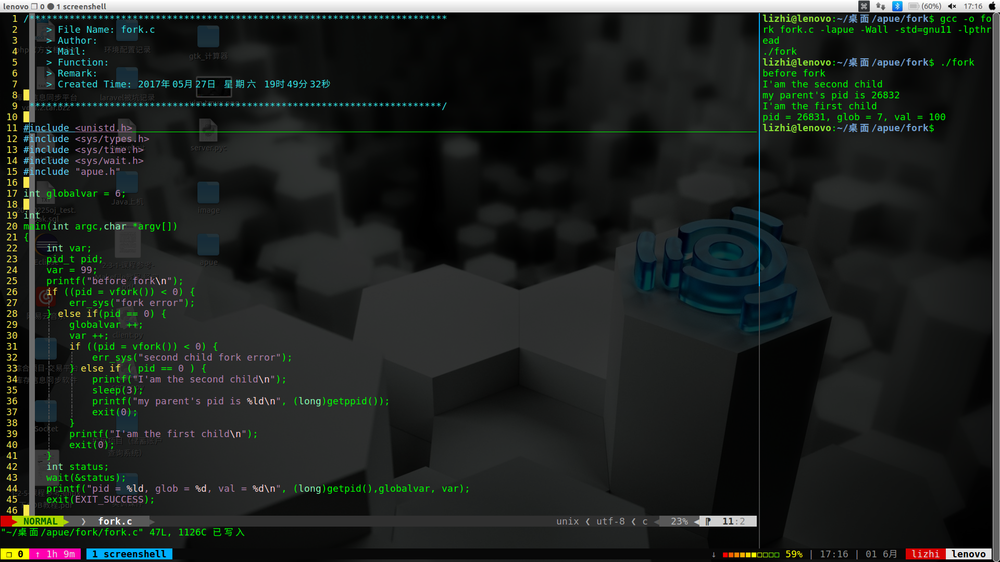
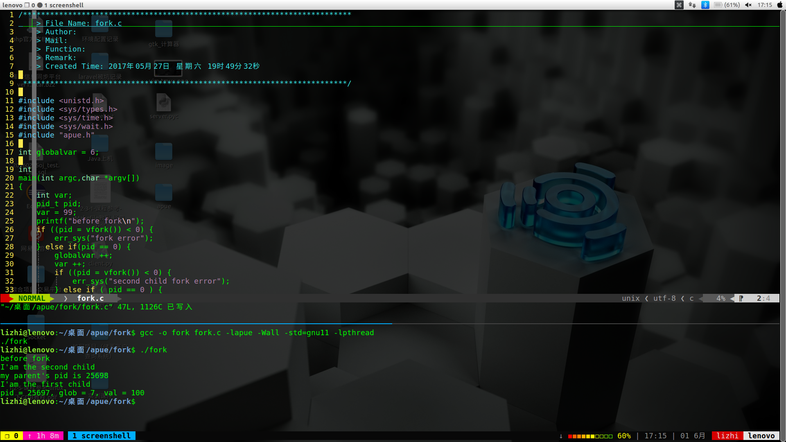
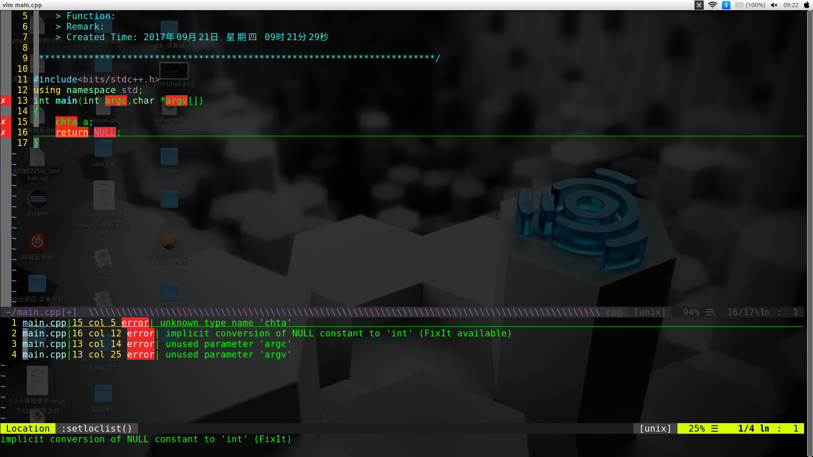

# vim配置文件
**[学长配置不再维护](https://github.com/ma6174/vim-deprecated)，更改为适合自己使用**
### 简易安装方法：
- git clone https://github.com/Lzgabel/vim.git
- bash install.sh

### 了解更多vim使用的小技巧：

[tips.md](tips.md)

### 查看更新日志：

[`update_log.md`](update_log.md)

# 终端复用模式
#### vim模式下:
- `可在vim普通模式/插入模式中<ctrl>+j下侧打开vim-tmux模式, <ctrl>+l右侧打开vim-tmux模式`
- `更改<ctrl+>+a为tmux前缀(prefix), prefix + '-':横向拆分窗口, prefix + '\':纵向拆分窗口。`
- `prefix+(h,j,k,l)映射同vim下窗口之间移动. 同时也可使用鼠标切换窗口或者拖动鼠标改变窗口大小`
- ` <ctrl>+c关闭vim-tmux模式 | prefix + & 关闭vim-tmux模式`

##### 窗口分屏
- `分屏大小可在.vim/bundle/screen/plugin/screen.vim 进行更改. 因个人审美观，需求，ScreenShellWidth被我设置为35`
- `更改配置请自行参考screen.txt`

# 程序编译
#### vim-tmux模式下, F5进行编译， F8进行gdb调试

# 错误调试
## YouComplete+syntastic 自动补全，语法检测
- `自动补全，可用方向键，<tab> 键选择， 回车确定`
- `普通模式下：<shift>+o打开错误面板， <shift>+c关闭错误面板， <shift>+n跳转下一个出错位置，<shift>+p跳转上一个出错位置`
- `当错误发生时，光标停留在错误面板列表栏中， 回车选中你所需要更改的错误信息，<shift>+n, <shift>+p跳转`
- `错误发生时， <shift>+f Fixit`

